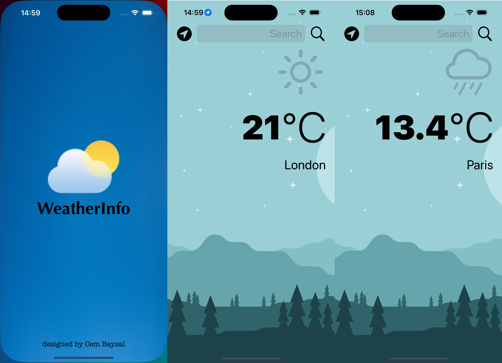

# WeatherApp 🌦️

A simple yet powerful iOS application to fetch and display the current weather of a city. Utilizing the OpenWeatherMap API, the app allows users to search for a city's weather or get weather updates based on their current location.

## Features 🌟

- **City Weather Search**: Just type in the city name and get instant weather updates.
- **Location-Based Weather**: Uses CoreLocation to get the user's current weather.
- **Modern UI**: Sleek and intuitive user interface with dynamic icons representing different weather conditions.

## Getting Started 🚀

### Prerequisites

- Xcode 12.0 or later
- iOS 14.0 or later

### Installation

1. Clone the repo:
    ```sh
    git clone https://github.com/cembaysaal/Weather-App.git
    ```

2. Open the project in Xcode:
3. Run the app on the desired simulator or physical device.

## Usage 💡

Simply launch the app, use the search bar to type in the name of any city, or press the location button to fetch weather based on your current location.

## Contributing 🤝

Contributions are welcome! Follow these steps to contribute:

1. Fork the repository.

2. Create a new branch for your feature or bug fix:

   ```bash
   git checkout -b feature/your-feature
   ```

3. Commit your changes and push them to your fork:

   ```bash
   git commit -m "Add your changes"
   git push origin feature/your-feature
   ```

4. Open a pull request with a clear description of your changes.

## License 📄

Distributed under the MIT License. See `LICENSE` for more information.

## Screenshots 📸

